<h1 align="center">轻存 · Roomy</h1>

<p align="center">安卓实况图片压缩 APP，让照片留得更轻。</p>

<p align="center">
  <a href="https://github.com/ShenZiLi/android-photo-compress/actions/workflows/release.yml"></a>
  
  
</p>

<p align="center">
  <a href="https://github.com/ShenZiLi/android-photo-compress/releases/latest"><b>下载安卓 APK</b></a> ·
  <a href="#核心页面">核心页面</a> ·
  <a href="#格式与兼容性">格式与兼容性</a> ·
  <a href="#构建与发布">构建与发布</a>
</p>

轻存（Roomy）是一款安卓实况图片压缩 APP，主打实况照片的本地压缩，也支持普通图片与视频。支持图集浏览、筛选、批量压缩与备份还原，用液态玻璃界面展示媒体占用与已省空间。

应用采用**有损压缩**。图片质量、视频码率与最终收益取决于文件内容、原始编码及设备能力，不承诺所有素材都能获得固定压缩率或完全无感的画质变化。

## 可以做什么

- **压缩图片、实况和视频**，可选将符合条件的 PNG 转为 JPEG。
- **按类型设置质量**，提供高质量、平衡、更省空间三档，实况的图片与视频段可分别调整。
- **按图集或单项批量处理**，支持类型筛选、全选与取消全选。
- **避免重复压缩**，无体积收益的图片保留原片，归入“已压缩”并标记“已跳过”。
- **备份与还原**，原片默认保留 30 天，支持按图片或图集还原；备份到期或清理后无法再还原。
- **全程本地处理**，无需联网；可随时取消队列，仅回退当前项，保留已完成的结果与备份。

## 核心页面

> 以下均为 **Android 16 / API 36 本地安卓虚拟机的真实截图**，分辨率 720 × 1600，来自 0.1.18 同源构建。图中的 Forest、Urban、Studio 为演示图集，媒体由本地程序合成，没有真实人物、地点或个人照片。图中数字来自应用实际扫描与压缩结果；不同截图展示流程中的不同阶段。

### 1. 总览 → 图集 → 图片网格

<table>
  <tr>
    <th>首页总览</th>
    <th>未压缩图集</th>
    <th>图片网格与多选</th>
  </tr>
  <tr>
    <td>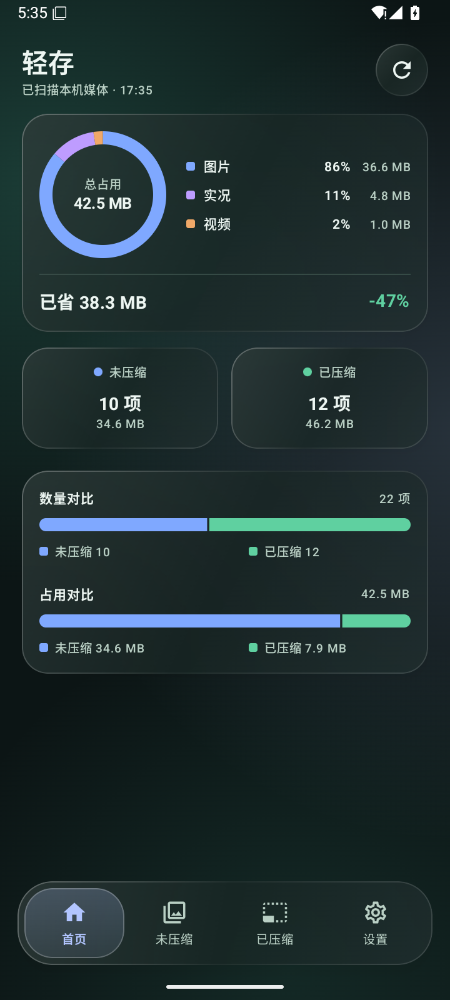</td>
    <td>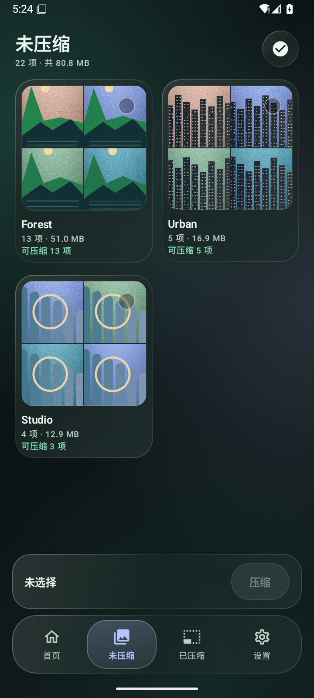</td>
    <td>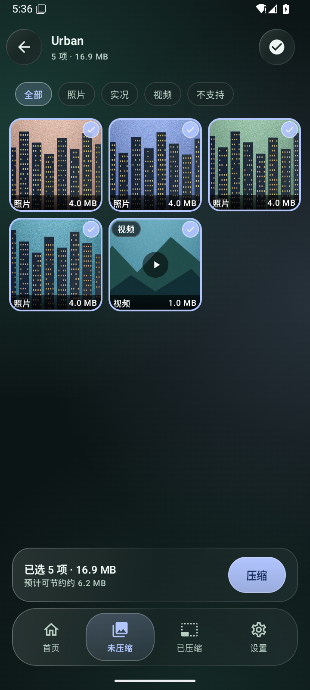</td>
  </tr>
</table>

- **首页**：查看图片、实况、视频各自占用，已省空间，以及未压缩与已压缩的数量、占用对比。右上角可重新扫描。
- **图集列表**：用四张缩略图预览图集，显示总项数、体积和可处理数量。点封面进入网格，点圆形选择控件选择图集。
- **图片网格**：支持图片、实况、视频及不支持项筛选。点图片勾选，长按查看详情；底部始终显示当前选择与操作按钮。

### 2. 确认压缩 → 查看结果 → 按需还原

<table>
  <tr>
    <th>压缩前确认</th>
    <th>已压缩与还原</th>
    <th>媒体信息</th>
  </tr>
  <tr>
    <td>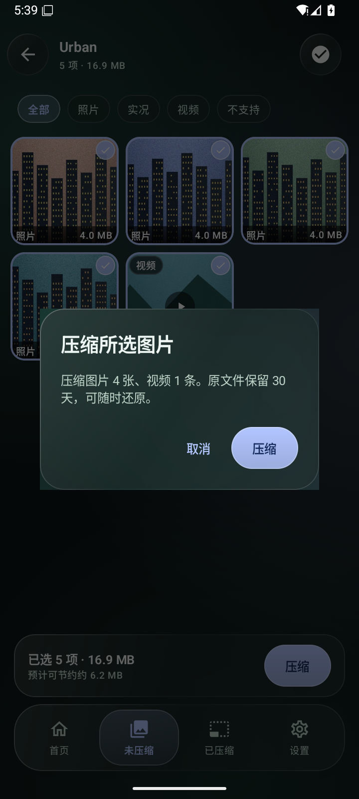</td>
    <td>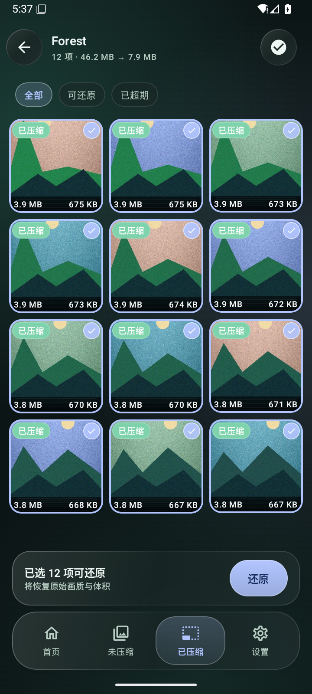</td>
    <td>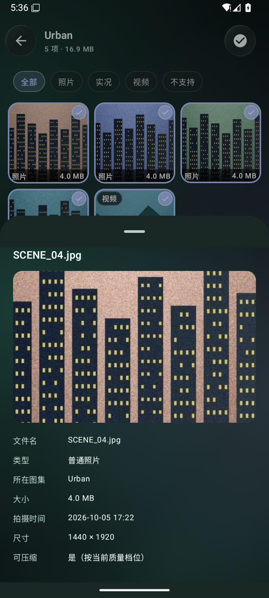</td>
  </tr>
</table>

压缩前按类型核对选择，确认后显示真实处理进度与结果。无法安全处理、没有体积收益或不满足完整性条件的项目会跳过，并保留原文件。

“已压缩”页同样采用图集 → 图片网格结构。网格展示已知的压缩前、压缩后体积；有可用备份的项目才能勾选还原。仅通过文件标记识别出的媒体可显示为已压缩，但没有账本和备份时无法恢复原始版本。

媒体信息面板展示文件名、类型、图集、体积、拍摄时间、尺寸及可处理状态；不支持项还会显示跳过原因。

### 3. 设置 → 压缩比例 → 回收站

<table>
  <tr>
    <th>设置</th>
    <th>独立质量档位</th>
    <th>回收站</th>
  </tr>
  <tr>
    <td>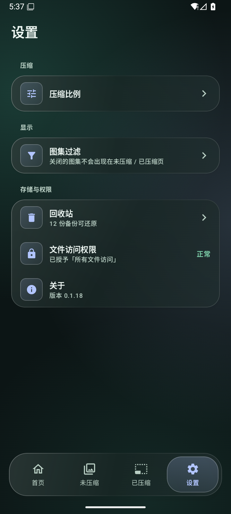</td>
    <td>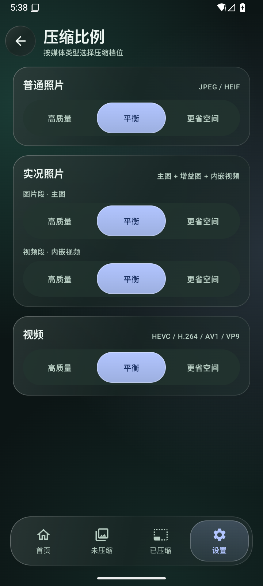</td>
    <td>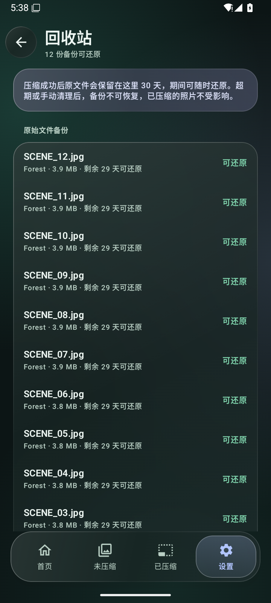</td>
  </tr>
</table>

先用平衡档观察效果，再按需求调整。实况照片可以保留较高的主图质量，同时提高视频段的压缩程度。

回收站保存压缩前的原始文件，默认保留 30 天。右上角删除按钮可清理全部备份，操作前有永久删除确认；清理后已压缩文件仍然保留。回收站、压缩比例和图集过滤均属于设置的二级页面，返回时回到设置。上述截图记录 0.1.18 的页面，右上角删除入口自 0.1.19 起提供。

**0.1.32 手动清理：** 确认永久删除后，回收站中的成功备份即使对应照片已移动、删除或大小变化，也允许清理。删除后不能再通过这些备份还原，现有照片不改写。自动到期清理仍执行安全检查，未完成恢复任务引用的备份继续保留。

**0.1.26 失败回滚：** 改写前持久记录原片备份，失败时撤销本次压缩登记、回滚原片和相册记录，失败照片留在未压缩页。完整回滚后清理本次临时备份；仍未恢复完整的项目显示“处理失败”，可从照片详情重试恢复，并继续保护原片备份。回收站只展示成功压缩的备份，已移除“找回照片”及失败恢复板块。来源不明的旧备份仍保留在应用私有目录，不会因移除板块而删除。

首页“已省”统计媒体文件的体积缩减，**不包含原始备份占用**。备份保留期间，手机上同时存在压缩文件与原始备份，实际可用空间可能暂时减少；备份清理后才能释放相应空间。

<details>
  <summary><b>展开查看：图集过滤与实况筛选</b></summary>
  <br>
  <table>
    <tr><th>图集过滤</th><th>实况筛选</th></tr>
    <tr>
      <td>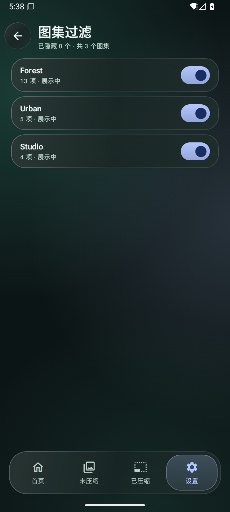</td>
      <td>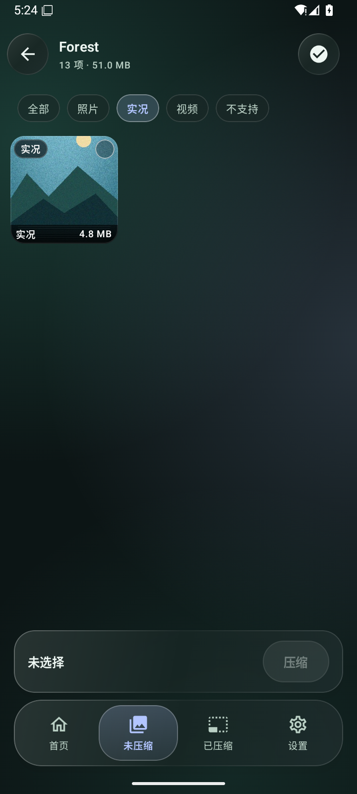</td>
    </tr>
  </table>
</details>

### 动效与操作反馈

页面进入和返回使用短方向过渡；导航、按钮、多选、筛选和质量档位使用轻量反馈；提示与确认弹窗自然进入、退出。常用反馈为 120–150ms，页面过渡为 220ms，业务操作即时执行。

类型菜单的动效贴合紧凑胶囊，列表只对位置变化做短过渡；数字即时更新，进度平滑展示真实任务值。新增动效支持系统关闭动画、节电及原生键盘输入模式下的即时回退。

## 怎么使用

1. 从 [Releases](https://github.com/ShenZiLi/android-photo-compress/releases/latest) 下载 `qingcun-v*.apk` 并安装。
2. 根据应用引导授予“所有文件访问”权限，用于读取媒体、原地改写和还原。
3. 在“设置 → 压缩比例”选择各类型档位；需要隐藏某些图集时，在“图集过滤”中关闭它们。
4. 在“未压缩”页选择图集或图片，核对确认弹窗，开始压缩。
5. 在“已压缩”页查看体积变化；在备份有效期内选择项目并还原。

**先用备份副本确认设备兼容性。** Releases 提供固定正式签名 APK、下载文件 SHA-256 和公开签名证书指纹。同一签名的后续版本可覆盖升级；正式签名 APK 不能直接覆盖其他签名的调试版。旧版还持有恢复备份时，不要为了切换签名直接卸载它：应用没有启用系统应用数据备份。

## 格式与兼容性

最低 Android 11 / API 30，当前编译与目标 SDK 为 36。首批参考设备为 **真我 GT7 Pro / Android 16**；用户将系统称为 ColorOS 16，具体行为以设备固件、编码器及原厂相册为准。

| 类型 | 当前处理方式与边界 |
| --- | --- |
| JPEG 图片 | 按档位重编码，搬运 EXIF / XMP 等已支持元信息；不满足完整性或收益条件时跳过 |
| 实况照片 | 识别 Google Motion Photo 与已适配的 oplus / realme 布局，重建相关长度、偏移与标记；已识别的增益图与厂商私有段按策略保留 |
| HEIC / HEIF | 0.1.31 起支持可安全解析的 8 位静态主图原格式压缩，保留 `.heic` 路径及原始元数据；HDR、深度/透明、序列及未知结构保留原片并说明原因 |
| PNG | 0.1.28 起可选转 JPEG；默认关闭，透明/APNG/不满足完整性条件时跳过，原 PNG 备份可还原 |
| MP4 视频 | 通过设备编解码器转码；输出编码依设备能力选用，保留已支持的音频、容器与相机元信息 |
| 10bit / HDR 视频 | “保真或跳过”：需具备相应编码能力并通过输出校验，不静默降级为 SDR |
| 多图 MPF JPEG | 0.1.25 起按全部索引处理两图、三图、四图、五图及更多图：压缩外层主图，所有附加图（含 HDR 增益图、内嵌 Original）、填充和厂商尾部原样保留，重建各 MPF 偏移；索引或图像边界无法安全解析时保留原片 |
| 多图实况 | MPF 三图及以上实况使用主图压缩路径，内嵌原始照片、视频和尾部原样保留，避免破坏关联结构；这一类只应用实况图片段档位，视频段档位不改变原样保留的视频 |
| 其他图片与视频容器 | GIF、WebP、BMP、AVIF、RAW/DNG、MOV 等当前按不支持处理 |

**实况兼容性是设备和样本级结论。** GT7 Pro 上的原厂相册动态及声音播放已由使用者确认修复成功；模拟器截图只展示应用页面，不能证明其他厂商相册、所有实况变体或 HDR 观感均兼容。

### 路径、元数据和时间

路径不变、拍摄时间、MediaStore 日期、文件系统创建与修改时间、元数据完整性及防重复处理，都是项目的完整性目标。它们并不是“相册排序没有变化”的同义词。

- JPEG、已适配实况、可处理 HEIC 和 MP4 使用备份 → 临时结果 → 校验 → 原地写入 → 时间及媒体库恢复的处理流程，失败时尝试回滚。
- 当前已有文件修改时间及部分 MediaStore 日期恢复能力；**尚未对所有 Android 文件系统保证创建时间完整保留**，早期模拟器 FUSE 场景已发现限制。
- 0.1.21 已停止 HEIC → JPEG 转换，避免格式/日期恢复失败造成原片消失。旧版转换产物还原时保留 JPEG 副本，直到用户自行核对。
- 不把结构自校验、编码器支持或模拟器运行成功当作所有设备完整性验收通过。

### 压缩速度与取消

0.1.19 将备份复制和 SHA-256 计算合并为一次顺序读取，JPEG 元数据查询只扫描段头，重组直接复制所需数据范围，减少整文件拷贝及输出扩容。视频优先使用满足尺寸和 HDR 要求的硬件编码器，直接创建选中的编码器，并在管线空闲时等待就绪缓冲区。质量档位没有降低，HDR 保真校验、媒体同步和原始备份仍然执行，具体提速幅度需在目标设备与相同素材上测量。

点击“取消”后不再开始下一项。当前项尚未改写原文件时会丢弃临时结果；已开始写入时恢复该项备份、修改时间和媒体库记录，清理该项未完成账本与临时文件。完成边界是文件、相册同步和账本保存均已结束，之前完成的项目不还原。JPEG 原生解码或编码等不可中断的单次平台调用结束后才检查取消，界面会持续显示取消状态。

历史实测及限制见 [验收报告](.trellis/tasks/10-04-photo-compress-app/research/acceptance-report.md)、[设备能力记录](.trellis/tasks/10-04-photo-compress-app/research/device-capability-report.md) 与 [UI 动效说明](.trellis/tasks/10-04-photo-compress-app/research/2026-10-06-motion-design.md)。历史报告包含早期版本结论，不能替代新设备的复验。

## 技术结构

| 模块 | 用途 |
| --- | --- |
| Kotlin + Jetpack Compose + Material 3 | 原生界面、导航、选择和交互状态 |
| Haze + 统一玻璃组件 | 背景采样与液态玻璃材质，照片和文字保持独立清晰 |
| MediaStore / ExifInterface | 媒体发现、元信息读取与媒体库同步 |
| MediaCodec / MediaMuxer | 视频及实况视频段的平台编码、封装能力 |
| JPEG / MPF / XMP / MP4 处理模块 | 容器解析、元数据搬运、实况重组及文件内标记 |
| Room | 压缩账本、档位设置、扫描缓存 |
| WorkManager | 备份到期清理 |

```text
app/src/main/java/com/photocompress/app/
├── ui/                 页面、组件、主题、动效与界面状态
├── data/               媒体读取、分类、设置与账本
└── core/               图片/视频/实况处理、容器与备份还原
```

## 构建与发布

### 本地调试

准备 JDK 17、Android SDK Platform 36 和 SDK Build Tools。在 `local.properties` 中配置本机 `sdk.dir`，或设置 `ANDROID_HOME`。

```powershell
# Windows
.\gradlew.bat :app:assembleDebug
```

```bash
# Linux / macOS
chmod +x gradlew
./gradlew :app:assembleDebug
```

调试 APK 输出到 `app/build/outputs/apk/debug/app-debug.apk`，使用调试签名。仓库不包含个人媒体、恢复备份、APK、签名私钥或签名密码。

### GitHub Actions 发布

[Release Android APP](.github/workflows/release.yml) 在推送 `v*` 标签时执行，也支持手动选择已有版本标签。标签必须与 `app/build.gradle.kts` 的 `versionName` 一致。

发布前在仓库 **Settings → Secrets and variables → Actions** 配置固定签名资料：

| Secret | 内容 |
| --- | --- |
| `ANDROID_SIGNING_KEYSTORE` | 签名密钥库的 Base64 内容 |
| `ANDROID_SIGNING_STORE_PASSWORD` | 密钥库密码 |
| `ANDROID_SIGNING_KEY_ALIAS` | 签名别名 |
| `ANDROID_SIGNING_KEY_PASSWORD` | 签名私钥密码 |

流程会安装 Android SDK、校验版本与签名配置、构建 release APK、验证 APK 签名、生成 SHA-256，并创建 GitHub Release。第三方 Actions 固定到提交编号；没有完整签名配置时拒绝构建正式包，已有 Release 不会被同一次重跑覆盖。

```bash
# versionName 例如为 0.1.18 时
git tag v0.1.18
git push origin master
git push origin v0.1.18
```

本地正式构建同样需要 `SIGNING_STORE_FILE`、`SIGNING_STORE_PASSWORD`、`SIGNING_KEY_ALIAS`、`SIGNING_KEY_PASSWORD` 四个环境变量，再执行 `:app:assembleRelease`。密钥需要在 Git 仓库之外单独保管，后续发布继续使用同一份签名资料。

## 项目约定

- 每个完成的变更单元提交本地 Git，Trellis 保存需求、规范与会话记录。
- 不提交真实个人照片、视频、元数据、恢复备份或签名资料。
- 区分已实现、已验证与待验证能力；遇到不满足条件的媒体给出跳过原因。

界面截图说明见 [docs/screenshots/README.md](docs/screenshots/README.md)。
